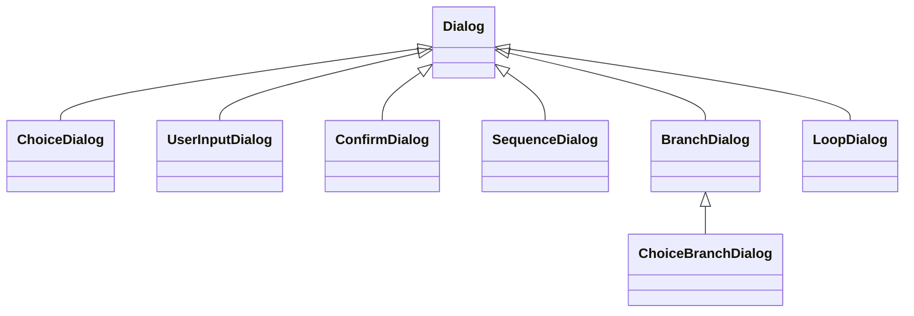

# Implementation Guide

This document describes the internal architecture, design patterns, and code flow of the bot framework.

## Architecture Overview

```
┌─────────────────────────────────────────────────────────────────┐
│                       BotApplication                            │
│  (Singleton - manages lifecycle, queue, events, commands)       │
├─────────────────────────────────────────────────────────────────┤
│                                                                 │
│  ┌──────────────┐    ┌──────────────┐    ┌──────────────────┐   │
│  │  TimeEvent   │    │ Condition    │    │ TelegramCommands │   │
│  │              │    │    Event     │    │      Event       │   │
│  └──────┬───────┘    └──────┬───────┘    └────────┬─────────┘   │
│         │                   │                     │            │
│         └───────────────────┼─────────────────────┘            │
│                             ▼                                   │
│                    ┌────────────────┐                           │
│                    │  Message Queue │                           │
│                    │  (EventMessage)│                           │
│                    └────────┬───────┘                           │
│                             │                                   │
│                             ▼                                   │
│                    ┌────────────────┐                           │
│                    │ Message Sender │                           │
│                    │    Worker      │                           │
│                    └────────┬───────┘                           │
│                             │                                   │
│                             ▼                                   │
│                    ┌────────────────┐                           │
│                    │  Telegram Bot  │                           │
│                    │      API       │                           │
│                    └────────────────┘                           │
└─────────────────────────────────────────────────────────────────┘
```

## Module Structure

```
my_bot_framework/
├── __init__.py           # Public API exports
├── bot_application.py    # BotApplication singleton and accessors
├── event.py              # Event system and commands
├── dialog.py             # Interactive dialog system
├── telegram_utilities.py # Message type wrappers
└── utilities.py          # Helper functions
```

## Core Design Patterns

### 1. Singleton Pattern - BotApplication

The `BotApplication` is a singleton ensuring a single bot instance exists globally:

```python
class BotApplication:
    _instance: Optional["BotApplication"] = None

    @classmethod
    def initialize(cls, token, chat_id, logger) -> "BotApplication":
        if cls._instance is not None:
            return cls._instance  # Return existing
        cls._instance = cls(Bot(token=token), chat_id, logger)
        return cls._instance

    @classmethod
    def get_instance(cls) -> "BotApplication":
        if cls._instance is None:
            raise RuntimeError("Not initialized")
        return cls._instance
```

Module-level accessors provide convenient access:

```python
def get_app() -> BotApplication:
    return BotApplication.get_instance()

def get_bot() -> Bot:
    return BotApplication.get_instance().bot
```

### 2. Producer-Consumer Pattern - Message Queue

Events produce `EventMessage` objects, the sender worker consumes them:

```
Events (Producers)          Queue              Sender (Consumer)
       │                      │                       │
       ├──EventMessage───────►│                       │
       │                      │◄──────get()───────────┤
       │                      │                       │
       │                      │───────message────────►│
       │                      │                       │
       │                      │                       ├──►Telegram API
```

The queue decouples message generation from sending, enabling:
- Rate limiting (0.05s delay between sends)
- Graceful shutdown (drain queue before exit)
- Non-blocking event loops

### 3. Template Method Pattern - Events

The `Event` base class defines the contract; subclasses implement `submit()`:

```python
class Event:
    async def submit(self, queue, stop_event) -> None:
        raise NotImplementedError

class TimeEvent(Event):
    async def submit(self, queue, stop_event) -> None:
        while not stop_event.is_set():
            await self._enqueue_message(queue)
            await _wait_or_stop(stop_event, self.interval_seconds)

class ActivateOnConditionEvent(Event):
    async def submit(self, queue, stop_event) -> None:
        while not stop_event.is_set():
            if self.condition_func():
                await self._enqueue_message(queue)
            await _wait_or_stop(stop_event, self.poll_seconds)
```

### 4. Strategy Pattern - Message Builders

Message builders are pluggable callables that generate content:

```python
# Strategy interface: Callable[..., MessageLike]
# where MessageLike = str | TelegramMessage | EventMessage | List[EventMessage] | None

def simple_builder():
    return "Hello!"

class ComplexBuilder(CallUpdatesInternalState):
    def __init__(self, threshold: int):
        self.threshold = threshold

    async def __call__(self, **kwargs):
        super().__call__(**kwargs)  # Update self.threshold from kwargs
        return f"Threshold: {self.threshold}"
```

### 5. Composite Pattern - Dialogs

Dialogs use the Composite pattern to build complex flows from simple components.

**Leaf Dialogs** (one question each):
- `ChoiceDialog` - User selects from keyboard options
- `UserInputDialog` - User enters text with optional validation
- `ConfirmDialog` - Yes/No prompt

**Composite Dialogs** (orchestrate children):
- `SequenceDialog` - Run dialogs in order with named values
- `BranchDialog` - Condition-based branching
- `ChoiceBranchDialog` - User selects branch via keyboard
- `LoopDialog` - Repeat until exit condition



**Shared Context**: All dialogs share a `context` dict for cross-dialog communication:

```python
# Values flow through context automatically
dialog = SequenceDialog([
    ("name", UserInputDialog("Enter name:")),
    ("tool", ChoiceDialog(
        prompt="Select tool:",
        choices=lambda ctx: [("Python", "py")] if ctx.get("name") else [],
    )),
])
```

**State Machine**:
```
INACTIVE ──start()──► ACTIVE/AWAITING_TEXT ──complete──► COMPLETE
                              │
                              └──cancel()──► COMPLETE (value=None)
```

```python
class DialogState(Enum):
    INACTIVE = "inactive"
    ACTIVE = "active"
    AWAITING_TEXT = "awaiting_text"
    COMPLETE = "complete"
```

## Execution Flow

### 1. Application Startup

```python
app = BotApplication.initialize(token, chat_id, logger)
app.register_event(my_event)
app.register_command(my_command)
await app.run()
```

**Inside `app.run()`:**

```
1. Register built-in commands (/terminate, /commands)
2. Flush pending updates (ignore messages sent before startup)
3. Create TelegramCommandsEvent with initial offset
4. Start message sender worker task
5. Start all event tasks concurrently
6. Wait for stop_event to be set
7. Drain message queue
8. Cancel all tasks
9. Return exit code
```

**Fresh Start:** The bot calls `flush_pending_updates()` on startup to clear any old messages. This ensures the bot only processes commands sent after it started.

### 2. Event Loop Flow

Each event runs its own async loop:

**TimeEvent:**
```
while not stop_event.is_set():
    if fire_on_first_check or not first_iteration:
        message = message_builder(*args, **kwargs)
        await queue.put(EventMessage(title, message))
    await _wait_or_stop(stop_event, interval_seconds)
```

**ActivateOnConditionEvent:**
```
while not stop_event.is_set():
    was_edited = self.edited  # Check if parameters changed
    self.edited = False

    condition_result = condition_func(*args, **kwargs)

    if condition_result or was_edited:
        merged_kwargs = {**base_kwargs, **editable_field_values}
        message = message_builder(*args, **merged_kwargs)
        await queue.put(EventMessage(title, message))

    await _wait_or_stop(stop_event, poll_seconds)
```

### 3. Command Processing Flow

**TelegramCommandsEvent polling:**
```
while not stop_event.is_set():
    updates = await bot.get_updates(offset, timeout)

    for update in updates:
        if update.message.text.startswith("/"):
            command = match_command(text)
            if command:
                # Command takes over - blocks until complete
                new_offset = await command.run(queue, offset)
            else:
                send_help_message()

    await _wait_or_stop(stop_event, poll_seconds)
```

**SimpleCommand execution:**
```
async def run(queue, update_offset):
    result = message_builder(*args, **kwargs)
    await queue.put(normalize(result))
    return update_offset  # No updates consumed
```

**DialogCommand execution:**
```
async def run(queue, update_offset):
    response = dialog.start()
    send_message_with_keyboard(response)

    while dialog.state != COMPLETE:
        updates = poll_updates()

        for update in updates:
            if update.callback_query:
                answer_callback(update.callback_query.id)
                response = dialog.handle_callback(callback_data)
                if response.edit_message:
                    edit_message(response)
                else:
                    send_new_message(response)

            elif update.message.text:
                response = dialog.handle_text_input(text)
                if response is None and dialog.is_active:
                    send_clarifying_message()
                    resend_keyboard()

    return current_offset
```

### 4. Message Sending Flow

```
queue.get() ──► EventMessage
                    │
                    ├── message_title: str
                    │
                    └── message_body: TelegramMessage
                              │
                              ▼
                    message_body.send(bot, chat_id, title, logger)
                              │
                    ┌─────────┴─────────────┐
                    │  TelegramTextMessage  │
                    │  - Chunk if > 4096    │
                    │  - Add title prefix   │
                    │  - Send each chunk    │
                    └───────────────────────┘
```

## Key Classes

### BotApplication

| Attribute | Type | Description |
|-----------|------|-------------|
| `bot` | `Bot` | Telegram Bot instance |
| `chat_id` | `str` | Allowed chat ID |
| `logger` | `Logger` | Application logger |
| `queue` | `Queue[EventMessage]` | Outgoing message queue |
| `stop_event` | `asyncio.Event` | Shutdown signal |
| `events` | `List[Event]` | Registered events |
| `commands` | `List[Command]` | Registered commands |

### Event Types

| Class | Trigger | Use Case |
|-------|---------|----------|
| `TimeEvent` | Fixed interval | Periodic status updates |
| `ActivateOnConditionEvent` | Condition becomes truthy | Alert systems |
| `TelegramCommandsEvent` | User sends "/" command | Command routing |

### Command Types

| Class | Behavior | Use Case |
|-------|----------|----------|
| `SimpleCommand` | Immediate response | Status queries, info |
| `DialogCommand` | Multi-step interaction | Settings, wizards |

### Message Types

| Class | Content | Features |
|-------|---------|----------|
| `TelegramTextMessage` | Plain text | Auto-chunking, title prefix |
| `TelegramImageMessage` | Image file | Caption support |
| `TelegramOptionsMessage` | Text + keyboard | Inline buttons |
| `TelegramEditMessage` | Edit existing | Update text/keyboard |
| `TelegramCallbackAnswerMessage` | Callback ACK | Toast notifications |

## Editable Fields System

The `Editable` mixin and `EditableField` class enable runtime parameter modification:

```
┌─────────────────────────────────────────────────────────────┐
│                  ActivateOnConditionEvent                   │
│                       (implements EditableMixin)            │
├─────────────────────────────────────────────────────────────┤
│  editable_fields: [                                         │
│      EditableField(name="threshold", ...)                   │
│      EditableField(name="scale", ...)                       │
│  ]                                                          │
│                                                             │
│  _get_message_builder_kwargs():                             │
│      return {**base_kwargs, **editable_field_values}        │
│                                                             │
│  When message_builder is called:                            │
│      builder(**merged_kwargs)                               │
│          │                                                  │
│          ▼                                                  │
│      CallUpdatesInternalState.__call__(**kwargs)            │
│          │                                                  │
│          └─► Updates builder's internal state               │
└─────────────────────────────────────────────────────────────┘
```

**Flow:**
1. Event has `editable_fields` list
2. External code modifies `field.value = "new_value"`
3. Event sets `self.edited = True`
4. On next poll, event merges field values into kwargs
5. Message builder receives updated values via `CallUpdatesInternalState`

## Async Patterns

### Cancelable Sleep

```python
async def _wait_or_stop(stop_event: asyncio.Event, seconds: float) -> None:
    """Sleep but return early if stop_event is set."""
    try:
        await asyncio.wait_for(stop_event.wait(), timeout=seconds)
    except asyncio.TimeoutError:
        return  # Normal timeout - continue
```

### Mixed Sync/Async Callables

```python
async def _maybe_await(func, *args, **kwargs):
    """Support both sync and async message builders."""
    result = func(*args, **kwargs)
    if asyncio.iscoroutine(result):
        return await result
    return result
```

### Thread-Safe Condition Checks

```python
# Run blocking condition in thread pool
condition_result = await asyncio.to_thread(
    self.condition_func,
    *self.condition_args,
    **self.condition_kwargs,
)
```

## Error Handling

### Message Sending

```python
async def send(self, bot, chat_id, title, logger):
    try:
        await bot.send_message(...)
    except Exception as exc:
        logger.error("telegram_send_failed error=%s", exc)
        await _try_send_error_message(bot, chat_id, title, logger, exc)
```

### Graceful Degradation

```python
async def _try_send_error_message(bot, chat_id, title, logger, exc):
    """Best-effort error notification without raising."""
    try:
        await bot.send_message(text=f"Error: {exc}")
    except Exception as error_exc:
        logger.error("error_message_also_failed error=%s", error_exc)
```

## Shutdown Sequence

```
1. stop_event.set()           # Signal all loops to stop
       │
       ▼
2. Events notice stop_event   # _wait_or_stop returns early
       │
       ▼
3. await queue.join()         # Wait for queue to drain
       │
       ▼
4. Cancel event tasks         # task.cancel() for each
       │
       ▼
5. Cancel sender task         # sender_task.cancel()
       │
       ▼
6. await gather(..., return_exceptions=True)  # Wait for cleanup
       │
       ▼
7. Return exit code
```

## UpdatePollerMixin Pattern

The `UpdatePollerMixin` provides a standardized polling pattern using the Template Method:

```
┌─────────────────────────────────────────────────────────────┐
│                    UpdatePollerMixin                        │
│              (Template Method Pattern)                      │
├─────────────────────────────────────────────────────────────┤
│  poll(update_offset) -> (result, final_offset):             │
│      while not should_stop_polling():                       │
│          updates = poll_updates(bot, chat_id, offset)       │
│          for update in updates:                             │
│              if callback_query:                             │
│                  handle_callback_update(update)             │
│              elif text_message:                             │
│                  handle_text_update(update)                 │
│      return _get_poll_result(), offset                      │
├─────────────────────────────────────────────────────────────┤
│  Abstract methods (subclasses implement):                   │
│    • should_stop_polling() -> bool                          │
│    • handle_callback_update(update) -> None                 │
│    • handle_text_update(update) -> None                     │
│    • _get_bot() -> Bot                                      │
│    • _get_chat_id() -> str                                  │
│    • _get_logger() -> Logger                                │
└─────────────────────────────────────────────────────────────┘
```

Classes that inherit `UpdatePollerMixin`:
- **Leaf Dialogs**: `ChoiceDialog`, `UserInputDialog`, `ConfirmDialog`
- **Hybrid Dialogs**: `ChoiceBranchDialog` (polls for selection, then delegates)
- **Events**: `TelegramCommandsEvent`

Composite dialogs (`SequenceDialog`, `BranchDialog`, `LoopDialog`, `DialogHandler`)
do NOT inherit `UpdatePollerMixin` - they delegate to children.

## Dialog System Architecture

```
┌─────────────────────────────────────────────────────────────┐
│                       Dialog (ABC)                          │
│         start(context, offset) -> (DialogResult, int)       │
├─────────────────────────────────────────────────────────────┤
│  Template method:                                           │
│    start():                                                 │
│      1. reset() - clean state                               │
│      2. Set context                                         │
│      3. _run_dialog() - delegate to subclass                │
│                                                             │
│  Abstract:                                                  │
│    • _run_dialog(offset) -> (DialogResult, int)             │
│    • build_result() -> DialogResult                         │
│    • handle_callback(data) -> DialogResponse                │
│    • handle_text_input(text) -> DialogResponse              │
└─────────────────────────────────────────────────────────────┘
                              │
          ┌───────────────────┼───────────────────┐
          │                   │                   │
          ▼                   ▼                   ▼
   ┌────────────┐    ┌─────────────────┐   ┌──────────────┐
   │Leaf Dialogs│    │Composite Dialogs│   │DialogHandler │
   │(+ Mixin)   │    │                 │   │              │
   ├────────────┤    ├─────────────────┤   ├──────────────┤
   │ Choice     │    │ Sequence        │   │ Wrap dialog  │
   │ UserInput  │    │ Branch          │   │ Call callback│
   │ Confirm    │    │ ChoiceBranch*   │   │ on complete  │
   └────────────┘    │ Loop            │   └──────────────┘
                     └─────────────────┘
                     (* hybrid - has Mixin)
```

### Cancellation with CANCELLED Sentinel

Use `CANCELLED` sentinel instead of `None` for unambiguous cancellation:

```python
from my_bot_framework import CANCELLED, is_cancelled

# Detect cancellation
if is_cancelled(result):
    # Handle cancelled dialog
    pass

# Or direct comparison
if result is CANCELLED:
    pass
```

### DialogResult and build_result()

Each dialog implements `build_result()` to create standardized nested dictionaries:

- **Leaf dialogs**: Return raw `value`
- **SequenceDialog**: Return `{name: child.build_result()}`
- **BranchDialog/ChoiceBranchDialog**: Return `{selected_key: branch.build_result()}`
- **LoopDialog**: Return final `value`
- **DialogHandler**: Return inner dialog's `build_result()`

## Extension Points

### Custom Event

```python
class CustomEvent(Event):
    async def submit(self, queue, stop_event):
        # Your custom event loop
        while not stop_event.is_set():
            # Your logic
            await _wait_or_stop(stop_event, interval)
```

### Custom Command

```python
class CustomCommand(Command):
    async def run(self, queue, update_offset) -> int:
        # Your command logic
        return update_offset
```

### Custom Dialog

The framework provides built-in dialog types. If you need a custom leaf dialog
that handles its own polling, inherit from both `Dialog` and `UpdatePollerMixin`:

```python
class CustomDialog(Dialog, UpdatePollerMixin):
    async def _run_dialog(self, update_offset: int = 0) -> Tuple[DialogResult, int]:
        # Send initial UI
        await self._send_response(response)
        # Poll until complete
        return await self.poll(update_offset)
    
    def build_result(self) -> DialogResult:
        return self.value
    
    def should_stop_polling(self) -> bool:
        return self.is_complete
    
    def _get_bot(self) -> Bot:
        return get_bot()
    
    def _get_chat_id(self) -> str:
        return get_chat_id()
    
    def _get_logger(self) -> logging.Logger:
        return get_logger()
    
    async def handle_callback_update(self, update: Update) -> None:
        # Handle callback queries
        pass
    
    async def handle_text_update(self, update: Update) -> None:
        # Handle text input
        pass
```

### Custom Message Type

```python
class TelegramDocumentMessage(TelegramMessage):
    async def send(self, bot, chat_id, title, logger):
        await bot.send_document(chat_id=chat_id, document=self.file)
```
