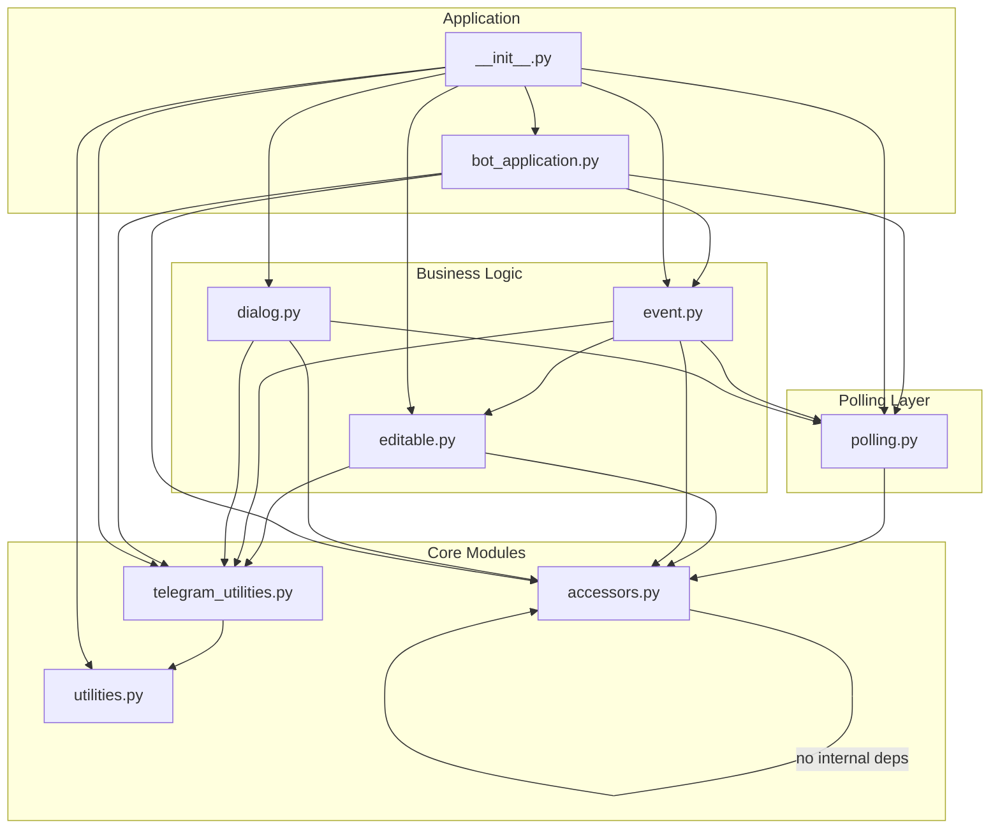
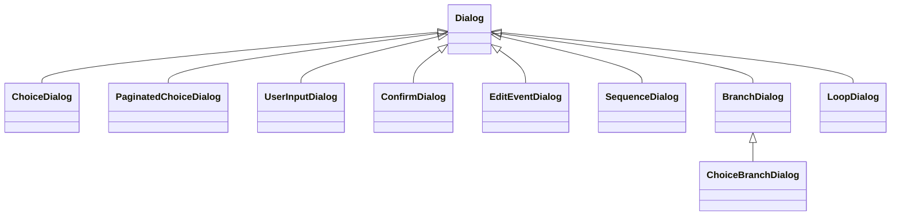
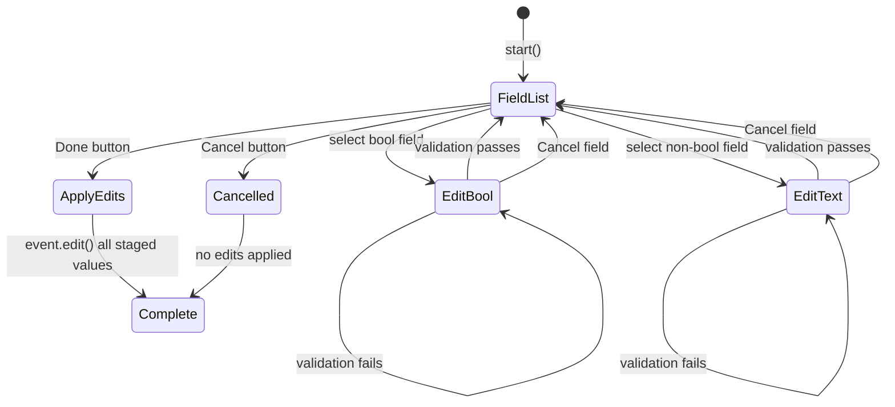

# Implementation Guide

This document describes the internal architecture, design patterns, and code flow of the bot framework.

## Architecture Overview

```
┌─────────────────────────────────────────────────────────────────┐
│                       BotApplication                            │
│  (Singleton - manages lifecycle, events, commands)              │
├─────────────────────────────────────────────────────────────────┤
│                                                                 │
│  ┌──────────────┐    ┌──────────────┐    ┌──────────────────┐   │
│  │    Time      │    │  Condition   │    │     Commands     │   │
│  │    Event     │    │    Event     │    │      Event       │   │
│  └──────┬───────┘    └──────┬───────┘    └────────┬─────────┘   │
│         │                   │                     │             │
│         └───────────────────┼─────────────────────┘             │
│                             │                                   │
│                             ▼                                   │
│                    ┌────────────────┐                           │
│                    │ send_messages() │                           │
│                    │ (Direct Send)  │                           │
│                    └────────┬────────┘                          │
│                             │                                   │
│                             ▼                                   │
│                    ┌────────────────┐                           │
│                    │  Telegram Bot  │                           │
│                    │      API       │                           │
│                    └────────────────┘                           │
└─────────────────────────────────────────────────────────────────┘
```

## Module Structure

```
my_bot_framework/
├── __init__.py           # Public API exports
├── accessors.py          # Singleton accessor functions (breaks circular deps)
├── bot_application.py    # BotApplication singleton
├── polling.py            # Update polling utilities and UpdatePollerMixin
├── event.py              # Event system and commands
├── event_examples/       # Event subclasses and factories
│   ├── __init__.py
│   ├── time_event.py     # TimeEvent (subclass of ActivateOnConditionEvent)
│   ├── threshold_event.py # ThresholdEvent (subclass of ActivateOnConditionEvent)
│   └── factories.py      # Factory functions (create_file_change_event)
├── dialog.py             # Interactive dialog system
├── telegram_utilities.py # Message type wrappers
└── utilities.py          # Helper functions
```

## Module Dependency Graph

The framework is organized to avoid circular imports. All imports are at the
top of each file (no late/inline imports needed).



### Dependency Table

| Module | Imports From |
|--------|--------------|
| `accessors.py` | *(no internal dependencies)* |
| `utilities.py` | *(no internal dependencies)* |
| `telegram_utilities.py` | `utilities` |
| `polling.py` | `accessors` |
| `editable.py` | `accessors`, `telegram_utilities` |
| `event.py` | `accessors`, `polling`, `telegram_utilities`, `editable` |
| `event_examples/factories.py` | `event`, `telegram_utilities` |
| `event_examples/time_event.py` | `event`, `telegram_utilities` |
| `event_examples/threshold_event.py` | `event`, `telegram_utilities` |
| `dialog.py` | `accessors`, `polling`, `telegram_utilities` |
| `bot_application.py` | `accessors`, `polling`, `event`, `telegram_utilities` |
| `__init__.py` | all modules (re-exports public API) |

### Why This Structure?

1. **`accessors.py`** - Holds the singleton reference and accessor functions.
   Other modules import these instead of importing from `bot_application.py`,
   breaking the circular dependency chain.

2. **`polling.py`** - Contains `UpdatePollerMixin` and polling functions.
   Both `event.py` and `dialog.py` need these, so extracting them to a
   separate module prevents circular imports between event and dialog.

3. **All imports at top** - No late/inline imports are needed. This makes
   the code cleaner and dependencies explicit.

## Core Design Patterns

### 1. Singleton Pattern - BotApplication

The `BotApplication` is a singleton ensuring a single bot instance exists globally:

```python
class BotApplication:
    _instance: Optional["BotApplication"] = None

    @classmethod
    def initialize(cls, token, chat_id, logger) -> "BotApplication":
        if cls._instance is not None:
            return cls._instance  # Return existing
        cls._instance = cls(Bot(token=token), chat_id, logger)
        return cls._instance

    @classmethod
    def get_instance(cls) -> "BotApplication":
        if cls._instance is None:
            raise RuntimeError("Not initialized")
        return cls._instance
```

Module-level accessors in `accessors.py` provide convenient access and break
circular dependencies:

```python
# accessors.py - no internal module dependencies
_instance: BotApplication | None = None

def _set_instance(app: BotApplication) -> None:
    global _instance
    _instance = app

def get_app() -> BotApplication:
    return _instance

def get_bot() -> Bot:
    return _instance.bot
```

The `BotApplication.initialize()` calls `_set_instance()` to register itself.

### 2. Direct Message Sending

Events produce `TelegramMessage` objects and send them directly via `BotApplication.send_messages()`:

```
Events (Producers)          BotApplication         Telegram API
       │                         │                      │
       ├──TelegramMessage────────►                      │
       │                         │                      │
       │                         ├──send_messages()─────┤
       │                         │                      │
       │                         │                      ├──►Sent
```

Messages are sent immediately when events fire. Each message type handles its own:
- Chunking for long text messages (TelegramTextMessage)
- Rate limiting (0.05s delay between chunks)
- Error handling with graceful degradation

### 3. Template Method Pattern - Events

The `Event` base class defines the contract; subclasses implement `submit()`:

```python
class Event:
    async def submit(self, stop_event: asyncio.Event) -> None:
        raise NotImplementedError

class ActivateOnConditionEvent(Event):
    async def submit(self, stop_event: asyncio.Event) -> None:
        while not stop_event.is_set():
            condition_result = await asyncio.to_thread(self.condition.check)
            if condition_result:
                message = await _maybe_await(self.message_builder.build)
                if message:
                    await get_app().send_messages(message)
            await _wait_or_stop(stop_event, self.poll_seconds)

# Time-based events use the TimeEvent subclass
event = TimeEvent(event_name="status", interval_hours=1.0, ...)
```

### 4. Strategy Pattern - Message Builders

Message builders are pluggable callables that generate content:

```python
# Strategy interface: Callable[..., MessageLike]
# where MessageLike = str | TelegramMessage | List[TelegramMessage] | None

def simple_builder():
    return "Hello!"

class ComplexBuilder(CallUpdatesInternalState):
    def __init__(self, threshold: int):
        self.threshold = threshold

    async def __call__(self, **kwargs):
        super().__call__(**kwargs)  # Update self.threshold from kwargs
        return f"Threshold: {self.threshold}"
```

### 5. Composite Pattern - Dialogs

Dialogs use the Composite pattern to build complex flows from simple components.

**Leaf Dialogs** (one question each):
- `ChoiceDialog` - User selects from keyboard options
- `PaginatedChoiceDialog` - User selects from paginated keyboard options (shows first page_size items as buttons, remaining items as numbered text list)
- `UserInputDialog` - User enters text with optional validation (prompt may be callable; keyboard removed on text input)
- `ConfirmDialog` - Yes/No prompt
- `EditEventDialog` - Edit an event's editable attributes via inline keyboard

**Composite Dialogs** (orchestrate children):
- `SequenceDialog` - Run dialogs in order with named values
- `BranchDialog` - Condition-based branching
- `ChoiceBranchDialog` - User selects branch via keyboard
- `LoopDialog` - Repeat until exit condition



**Shared Context**: All dialogs share a `context` dict for cross-dialog communication:

```python
# Values flow through context automatically
dialog = SequenceDialog([
    ("name", UserInputDialog("Enter name:")),
    ("tool", ChoiceDialog(
        prompt="Select tool:",
        choices=lambda ctx: [("Python", "py")] if ctx.get("name") else [],
    )),
])
```

**State Machine**:
```
INACTIVE ──start()──► ACTIVE/AWAITING_TEXT ──complete──► COMPLETE
                              │
                              └──cancel()──► COMPLETE (value=None)
```

```python
class DialogState(Enum):
    INACTIVE = "inactive"
    ACTIVE = "active"
    AWAITING_TEXT = "awaiting_text"
    COMPLETE = "complete"
```

## Execution Flow

### 1. Application Startup

```python
app = BotApplication.initialize(token, chat_id, logger)
app.register_event(my_event)
app.register_command(my_command)
await app.run()
```

**Inside `app.run()`:**

```
1. Register built-in commands (/terminate, /commands)
2. Flush pending updates (ignore messages sent before startup)
3. Create CommandsEvent with initial offset
4. Start all event tasks concurrently (each runs submit(stop_event))
5. Wait for stop_event to be set
6. Cancel all event tasks
7. Wait for tasks to complete cancellation
8. Return exit code (0)
```

**Fresh Start:** The bot calls `flush_pending_updates()` on startup to clear any old messages. This ensures the bot only processes commands sent after it started.

### 2. Event Loop Flow

Each event runs its own async loop:

**ActivateOnConditionEvent (base class for TimeEvent, ThresholdEvent):**
```
while not stop_event.is_set():
    was_edited = self.edited  # Check if parameters changed
    self.edited = False

    condition_result = condition.check()

    # Fire if condition is true, or if edited AND fire_when_edited is enabled
    should_fire = condition_result or (was_edited and self.fire_when_edited)
    if should_fire:
        message = message_builder.build()
        logger.info("event_message_queued event_name=%s", event_name)
        await get_app().send_messages(message)  # Via BotApplication helper

    await _wait_or_stop(stop_event, poll_seconds)
```

**fire_when_edited behavior:**
- `True` (default): Editing triggers immediate fire even if condition is False
- `False`: Editing triggers immediate re-check but only fires if condition is True

### 3. Command Processing Flow

**CommandsEvent polling:**
```
while not stop_event.is_set():
    updates = await poll_updates(bot)

    for update in updates:
        if update.message.text.startswith("/"):
            command = match_command(text)
            if command:
                # Set offset past this command before running
                set_next_update_id(update.update_id + 1)
                # Command takes over - blocks until complete
                await command.run()
            else:
                await get_app().send_messages(help_message)

    await _wait_or_stop(stop_event, poll_seconds)
```

**SimpleCommand execution:**
```
async def run():
    result = await _maybe_await(message_builder)  # No-arg callable
    if result:
        await get_app().send_messages(result)
    return None  # No result
```

**DialogCommand execution:**
```
async def run():
    response = dialog.start()
    send_message_with_keyboard(response)

    while dialog.state != COMPLETE:
        updates = poll_updates()

        for update in updates:
            if update.callback_query:
                answer_callback(update.callback_query.id)
                response = dialog.handle_callback(callback_data)
                if response.edit_message:
                    edit_message(response)
                else:
                    send_new_message(response)

            elif update.message.text:
                response = dialog.handle_text_input(text)
                if response is None and dialog.is_active:
                    send_clarifying_message()
                    resend_keyboard()

    return current_offset
```

### 4. Message Sending Flow

```
send_messages() ──► TelegramMessage
                        │
                        ▼
                message.send(bot, chat_id, logger)
                        │
              ┌─────────┴─────────────┐
              │  TelegramTextMessage  │
              │  - Chunk if > 4096    │
              │  - Send each chunk    │
              │  - 0.05s delay between│
              └───────────────────────┘
```

Note: Event logging (event_name) happens at the call site before sending,
not during message sending.

## Key Classes

### BotApplication

| Attribute | Type | Description |
|-----------|------|-------------|
| `bot` | `Bot` | Telegram Bot instance |
| `chat_id` | `str` | Allowed chat ID |
| `logger` | `Logger` | Application logger |
| `stop_event` | `asyncio.Event` | Shutdown signal |
| `events` | `List[Event]` | Registered events |
| `commands` | `List[Command]` | Registered commands |

| Method | Description |
|--------|-------------|
| `initialize(token, chat_id, logger)` | Create and initialize the singleton |
| `get_instance()` | Get the existing singleton |
| `register_event(event)` | Register an event to run |
| `register_command(command)` | Register a command handler |
| `send_messages(messages)` | Send message(s) immediately (str, TelegramMessage, or list) |
| `run()` | Start the bot (blocks until shutdown) |

### Event Types

| Class | Trigger | Use Case |
|-------|---------|----------|
| `ActivateOnConditionEvent` | Condition becomes truthy | Alert systems |
| `CommandsEvent` | User sends "/" command | Command routing |

### Event Factories

Factory functions create pre-configured `ActivateOnConditionEvent` instances:

### Event Subclasses (in event_examples/)

| Class | Base | Use Case |
|-------|------|----------|
| `TimeEvent` | `ActivateOnConditionEvent` | Periodic status updates, heartbeats |
| `ThresholdEvent` | `ActivateOnConditionEvent` | Value exceeds/drops below limit |

### Event Factories

| Factory | Creates | Use Case |
|---------|---------|----------|
| `create_threshold_event` | Threshold monitor | Value crosses threshold with cooldown |
| `create_file_change_event` | File watcher | Config changes, log updates |

These factories encapsulate common condition patterns with internal state management.

### Command Types

| Class | Behavior | Use Case |
|-------|----------|----------|
| `SimpleCommand` | Immediate response | Status queries, info |
| `DialogCommand` | Multi-step interaction | Settings, wizards |

### Message Types

| Class | Content | Features |
|-------|---------|----------|
| `TelegramTextMessage` | Plain text | Auto-chunking for long messages |
| `TelegramImageMessage` | Image file | Caption support |
| `TelegramDocumentMessage` | Document file | Caption support |
| `TelegramOptionsMessage` | Text + keyboard | Inline buttons |
| `TelegramEditMessage` | Edit existing | Update text/keyboard |
| `TelegramCallbackAnswerMessage` | Callback ACK | Toast notifications |

**Note:** All message types use `parse_mode=HTML`. If text contains unescaped HTML special characters, an `InvalidHtmlError` is raised with instructions to use `html.escape()`.

## Editable Attributes System

The `EditableMixin` and `EditableAttribute` classes enable runtime parameter modification
across explicit `Condition` and `MessageBuilder` collaborators. These classes are defined
in the `editable.py` module.

```
┌─────────────────────────────────────────────────────────────┐
│                  ActivateOnConditionEvent                   │
│                       (implements EditableMixin)            │
├─────────────────────────────────────────────────────────────┤
│  condition: Condition (EditableMixin)                       │
│  builder:   MessageBuilder (EditableMixin)                  │
│                                                             │
│  event.edit("condition.threshold", "95")                    │
│       │                                                     │
│       ▼                                                     │
│  condition.edit("threshold", "95")                          │
│       │                                                     │
│       └─► EditableAttribute parses & validates              │
└─────────────────────────────────────────────────────────────┘
```

**Flow:**
1. Event owns a `Condition` and `MessageBuilder`, each with editable attributes
2. External code calls `event.edit("condition.<name>", value)` or `event.edit("builder.<name>", value)`
3. Edit is validated and applied immediately (fail-fast on errors)
4. Event is marked `edited = True` for immediate re-check on the next poll
5. `condition.check()` and `builder.build()` read their own attributes via `get()`

### EditableAttribute Factory Methods

The `EditableAttribute` class provides factory methods for creating common types with
built-in validation:

- **`float(name, initial_value, *, positive=False, min_val=None, max_val=None, optional=False)`** - Float with optional constraints. Set `optional=True` to allow None values.
- **`int(name, initial_value, *, positive=False, min_val=None, max_val=None, optional=False)`** - Integer with optional constraints. Set `optional=True` to allow None values.
- **`bool(name, initial_value, *, optional=False)`** - Boolean (parses common boolean strings). Set `optional=True` to allow None values.
- **`str(name, initial_value, *, choices=None, optional=False)`** - String with optional choices validation. Set `optional=True` to allow None values.

These factory methods simplify attribute creation:

```python
# Before (verbose)
EditableAttribute(
    name="threshold", field_type=int, initial_value=90,
    parse=int, validator=lambda v: (v >= 0 and v <= 100, "Must be 0-100")
)

# After (concise factory methods)
EditableAttribute.int("threshold", 90, min_val=0, max_val=100)
```

### Module Structure

The `editable.py` module contains:
- **`EditableAttribute`** - Core class for typed, validated, editable values with factory methods
- **`EditableMixin`** - Mixin for objects with editable attributes
- **`Condition`** - Abstract interface for editable conditions
- **`MessageBuilder`** - Abstract interface for editable message builders
- **`FunctionCondition`** - Wrapper for no-arg callables as conditions
- **`FunctionMessageBuilder`** - Wrapper for no-arg callables as message builders

## Async Patterns

### Cancelable Sleep

```python
async def _wait_or_stop(stop_event: asyncio.Event, seconds: float) -> None:
    """Sleep but return early if stop_event is set."""
    try:
        await asyncio.wait_for(stop_event.wait(), timeout=seconds)
    except asyncio.TimeoutError:
        return  # Normal timeout - continue
```

### Mixed Sync/Async Callables

```python
async def _maybe_await(func, *args, **kwargs):
    """Support both sync and async message builders."""
    result = func(*args, **kwargs)
    if asyncio.iscoroutine(result):
        return await result
    return result
```

### Thread-Safe Condition Checks

```python
# Run blocking condition in thread pool
condition_result = await asyncio.to_thread(self.condition.check)
```

## Error Handling

### Message Sending

```python
async def send(self, bot, chat_id, title, logger):
    try:
        await bot.send_message(...)
    except Exception as exc:
        if _is_html_parse_error(exc):
            raise InvalidHtmlError(exc, self.message) from exc
        logger.error("telegram_send_failed error=%s", exc)
        await _try_send_error_message(bot, chat_id, title, logger, exc)
```

### HTML Parse Errors

All messages are sent with `parse_mode=HTML`. If the text contains invalid HTML (e.g., unescaped `<`, `>`, `&`), Telegram will reject the message. The framework catches these errors and raises an `InvalidHtmlError` to provide clear guidance:

```python
class InvalidHtmlError(Exception):
    """Raised when message text contains invalid HTML that Telegram cannot parse."""
    
    def __init__(self, original_error: Exception, text: str) -> None:
        # Message tells user to use html.escape()
        super().__init__(
            f"Message contains invalid HTML that Telegram cannot parse. "
            f"Use html.escape() on your text before passing it to TelegramMessage. "
            f"Original error: {original_error}. "
            f"Text (truncated): {text[:100]!r}"
        )
        self.original_error = original_error
        self.text = text
```

Detection is done via `_is_html_parse_error()` which checks for Telegram's `BadRequest` with "can't parse entities" in the message.

### Graceful Degradation

```python
async def _try_send_error_message(bot, chat_id, title, logger, exc):
    """Best-effort error notification without raising."""
    try:
        # Sent without parse_mode to avoid HTML issues in error messages
        await bot.send_message(text=f"Error: {exc}")
    except Exception as error_exc:
        logger.error("error_message_also_failed error=%s", error_exc)
```

## Shutdown Sequence

```
1. stop_event.set()           # Signal all loops to stop
       │
       ▼
2. Events notice stop_event   # _wait_or_stop returns early
       │
       ▼
3. Cancel event tasks         # task.cancel() for each
       │
       ▼
4. await gather(..., return_exceptions=True)  # Wait for cleanup
       │
       ▼
5. Return exit code (0)
```

## UpdatePollerMixin Pattern

The `UpdatePollerMixin` (defined in `polling.py`) provides a standardized polling
pattern using the Template Method:

```
┌─────────────────────────────────────────────────────────────┐
│                    UpdatePollerMixin                        │
│              (Template Method Pattern)                      │
├─────────────────────────────────────────────────────────────┤
│  poll() -> result:                                          │
│      while not should_stop_polling():                       │
│          updates = poll_updates(bot)                        │
│          for update in updates:                             │
│              if callback_query:                             │
│                  handle_callback_update(update)             │
│              elif text_message:                             │
│                  handle_text_update(update)                 │
│      return _get_poll_result()                              │
├─────────────────────────────────────────────────────────────┤
│  Abstract methods (subclasses implement):                   │
│    • should_stop_polling() -> bool                          │
│    • handle_callback_update(update) -> None                 │
│    • handle_text_update(update) -> None                     │
│                                                             │
│  Update offset is managed globally via:                     │
│    • get_next_update_id() / set_next_update_id()            │
│                                                             │
│  Uses singleton accessors: get_bot(), get_chat_id(),        │
│  get_logger() for dependencies.                             │
└─────────────────────────────────────────────────────────────┘
```

Classes that inherit `UpdatePollerMixin`:
- **Leaf Dialogs**: `ChoiceDialog`, `PaginatedChoiceDialog`, `UserInputDialog`, `ConfirmDialog`, `EditEventDialog`
- **Hybrid Dialogs**: `ChoiceBranchDialog` (polls for selection, then delegates)
- **Events**: `CommandsEvent`

Composite dialogs (`SequenceDialog`, `BranchDialog`, `LoopDialog`, `DialogHandler`)
do NOT inherit `UpdatePollerMixin` - they delegate to children.

## Dialog System Architecture

```
┌─────────────────────────────────────────────────────────────┐
│                       Dialog (ABC)                          │
│              start(context) -> DialogResult                 │
├─────────────────────────────────────────────────────────────┤
│  Template method:                                           │
│    start():                                                 │
│      1. reset() - clean state                               │
│      2. Set context                                         │
│      3. _run_dialog() - delegate to subclass                │
│                                                             │
│  Abstract:                                                  │
│    • _run_dialog(offset) -> (DialogResult, int)             │
│    • build_result() -> DialogResult                         │
│    • handle_callback(data) -> DialogResponse                │
│    • handle_text_input(text) -> DialogResponse              │
└─────────────────────────────────────────────────────────────┘
                              │
          ┌───────────────────┼───────────────────┐
          │                   │                   │
          ▼                   ▼                   ▼
   ┌────────────┐    ┌─────────────────┐   ┌──────────────┐
   │Leaf Dialogs│    │Composite Dialogs│   │DialogHandler │
   │(+ Mixin)   │    │                 │   │              │
   ├────────────┤    ├─────────────────┤   ├──────────────┤
   │ Choice     │    │ Sequence        │   │ Wrap dialog  │
   │ Paginated  │    │ Branch          │   │ Call callback│
   │ Choice     │    │ ChoiceBranch*   │   │ on complete  │
   │ UserInput  │    │ Loop            │   └──────────────┘
   │ Confirm    │    └─────────────────┘
   └────────────┘    (* hybrid - has Mixin)
```

### Cancellation with CANCELLED Sentinel

Use `CANCELLED` sentinel instead of `None` for unambiguous cancellation:

```python
from my_bot_framework import CANCELLED, is_cancelled

# Detect cancellation
if is_cancelled(result):
    # Handle cancelled dialog
    pass

# Or direct comparison
if result is CANCELLED:
    pass
```

### DialogResult and build_result()

Each dialog implements `build_result()` to create standardized nested dictionaries:

- **Leaf dialogs**: Return raw `value`
- **SequenceDialog**: Return `{name: child.build_result()}`
- **BranchDialog/ChoiceBranchDialog**: Return `{selected_key: branch.build_result()}`
- **LoopDialog**: Return final `value`
- **DialogHandler**: Return inner dialog's `build_result()`
- **EditEventDialog**: Return context dict with all edited field values

## EditEventDialog Architecture

`EditEventDialog` provides a generic UI for editing any `ActivateOnConditionEvent`'s editable attributes via Telegram inline keyboard.

### State Machine



### Key Design: Staged Edits

Edits are staged in the dialog's context dict and only applied to the event when clicking Done:

1. **Field selection**: User clicks a field button, dialog shows editor
2. **Value entry**: User enters value (text or bool toggle)
3. **Validation**: Single-field validation, then optional cross-field validation
4. **Staging**: Valid value stored in context, return to field list
5. **Done**: All staged edits applied via `event.edit()`, `event.edited = True`
6. **Cancel from field list**: No edits applied, returns `CANCELLED`

### Cross-Field Validation

Optional `validator` parameter enables complex validation rules:

```python
def validate_range(context: Dict[str, Any]) -> Tuple[bool, str]:
    """Ensure min < max. Called after each field edit."""
    min_val = context.get("condition.limit_min", event.get("condition.limit_min"))
    max_val = context.get("condition.limit_max", event.get("condition.limit_max"))
    
    if min_val is not None and max_val is not None:
        if min_val >= max_val:
            return False, f"limit_min ({min_val}) must be < limit_max ({max_val})"
    return True, ""

dialog = EditEventDialog(event, validator=validate_range)
```

The validator runs after each field edit. If it fails, the user must fix the value or cancel the field edit.

**Note:** Validation error messages are displayed as HTML. If your error messages contain special characters like `<`, `>`, or `&`, use `html.escape()` to prevent parsing errors.

## Extension Points

### Custom Event

```python
class CustomEvent(Event):
    async def submit(self, stop_event: asyncio.Event) -> None:
        # Your custom event loop
        while not stop_event.is_set():
            # Your logic
            await _wait_or_stop(stop_event, interval)
```

### Custom Command

```python
class CustomCommand(Command):
    async def run(self) -> Any:
        # Your command logic
        return None
```

### Custom Dialog

The framework provides built-in dialog types. If you need a custom leaf dialog
that handles its own polling, inherit from both `Dialog` and `UpdatePollerMixin`:

```python
from my_bot_framework import Dialog, UpdatePollerMixin

class CustomDialog(Dialog, UpdatePollerMixin):
    async def _run_dialog(self) -> DialogResult:
        # Send initial UI
        await self._send_response(response)
        # Poll until complete
        return await self.poll()
    
    def build_result(self) -> DialogResult:
        return self.value
    
    def should_stop_polling(self) -> bool:
        return self.is_complete
    
    # Uses singleton accessors: get_bot(), get_chat_id(), get_logger()
    
    async def handle_callback_update(self, update: Update) -> None:
        # Handle callback queries
        pass
    
    async def handle_text_update(self, update: Update) -> None:
        # Handle text input
        pass
```

### Custom Message Type

```python
class TelegramCustomMessage(TelegramMessage):
    async def send(self, bot, chat_id, logger):
        await bot.send_message(chat_id=chat_id, text=self.text)
```
