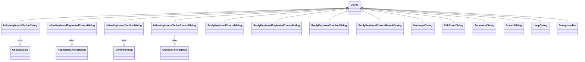

# Implementation Guide

This document describes the internal architecture, design patterns, and code flow of the bot framework.

## Architecture Overview

```
┌─────────────────────────────────────────────────────────────────┐
│                       BotApplication                            │
│  (Singleton - manages lifecycle, events, commands)              │
├─────────────────────────────────────────────────────────────────┤
│                                                                 │
│  ┌──────────────┐    ┌──────────────┐    ┌──────────────────┐   │
│  │    Time      │    │  Condition   │    │     Commands     │   │
│  │    Event     │    │    Event     │    │      Event       │   │
│  └──────┬───────┘    └──────┬───────┘    └────────┬─────────┘   │
│         │                   │                     │             │
│         └───────────────────┼─────────────────────┘             │
│                             │                                   │
│                             ▼                                   │
│                    ┌────────────────┐                           │
│                    │ send_messages() │                           │
│                    │ (Direct Send)  │                           │
│                    └────────┬────────┘                          │
│                             │                                   │
│                             ▼                                   │
│                    ┌────────────────┐                           │
│                    │  Telegram Bot  │                           │
│                    │      API       │                           │
│                    └────────────────┘                           │
└─────────────────────────────────────────────────────────────────┘
```

## Module Structure

```
my_bot_framework/
├── __init__.py           # Public API exports
├── accessors.py          # Singleton accessor functions (breaks circular deps)
├── bot_application.py    # BotApplication singleton
├── polling.py            # Update polling utilities and UpdatePollerMixin
├── event.py              # Event system and commands
├── event_examples/       # Event subclasses and factories
│   ├── __init__.py
│   ├── time_event.py     # TimeEvent (subclass of ActivateOnConditionEvent)
│   ├── threshold_event.py # ThresholdEvent (subclass of ActivateOnConditionEvent)
│   └── factories.py      # Factory functions (create_file_change_event)
├── dialog.py             # Interactive dialog system
├── telegram_utilities.py # Message type wrappers
├── utilities.py          # Helper functions
└── validators.py         # Reusable validation functions for UserInputDialog
```

## Module Dependency Graph

The framework is organized to avoid circular imports. All imports are at the
top of each file (no late/inline imports needed).


### Dependency Table

| Module | Imports From |
|--------|--------------|
| `accessors.py` | *(no internal dependencies)* |
| `utilities.py` | *(no internal dependencies)* |
| `telegram_utilities.py` | `utilities` |
| `polling.py` | `accessors` |
| `editable.py` | `accessors`, `telegram_utilities` |
| `event.py` | `accessors`, `polling`, `telegram_utilities`, `editable` |
| `event_examples/factories.py` | `event`, `telegram_utilities` |
| `event_examples/time_event.py` | `event`, `telegram_utilities` |
| `event_examples/threshold_event.py` | `event`, `telegram_utilities` |
| `dialog.py` | `accessors`, `polling`, `telegram_utilities` |
| `validators.py` | *(no internal dependencies - uses stdlib only)* |
| `bot_application.py` | `accessors`, `polling`, `event`, `telegram_utilities` |
| `__init__.py` | all modules (re-exports public API) |

### Why This Structure?

1. **`accessors.py`** - Holds the singleton reference and accessor functions.
   Other modules import these instead of importing from `bot_application.py`,
   breaking the circular dependency chain.

2. **`polling.py`** - Contains `UpdatePollerMixin` and polling functions.
   Both `event.py` and `dialog.py` need these, so extracting them to a
   separate module prevents circular imports between event and dialog.

3. **All imports at top** - No late/inline imports are needed. This makes
   the code cleaner and dependencies explicit.

## Core Design Patterns

### 1. Singleton Pattern - BotApplication

The `BotApplication` is a singleton ensuring a single bot instance exists globally:

```python
class BotApplication:
    _instance: Optional["BotApplication"] = None

    @classmethod
    def initialize(cls, token, chat_id, logger) -> "BotApplication":
        if cls._instance is not None:
            return cls._instance  # Return existing
        cls._instance = cls(Bot(token=token), chat_id, logger)
        return cls._instance

    @classmethod
    def get_instance(cls) -> "BotApplication":
        if cls._instance is None:
            raise RuntimeError("Not initialized")
        return cls._instance
```

Module-level accessors in `accessors.py` provide convenient access and break
circular dependencies:

```python
# accessors.py - no internal module dependencies
_instance: BotApplication | None = None

def _set_instance(app: BotApplication) -> None:
    global _instance
    _instance = app

def get_app() -> BotApplication:
    return _instance

def get_bot() -> Bot:
    return _instance.bot
```

The `BotApplication.initialize()` calls `_set_instance()` to register itself.

### 2. Direct Message Sending

Events produce `TelegramMessage` objects and send them directly via `BotApplication.send_messages()`:

```
Events (Producers)          BotApplication         Telegram API
       │                         │                      │
       ├──TelegramMessage────────►                      │
       │                         │                      │
       │                         ├──send_messages()─────┤
       │                         │                      │
       │                         │                      ├──►Sent
```

Messages are sent immediately when events fire. Each message type handles its own:
- Chunking for long text messages (TelegramTextMessage)
- Rate limiting (0.05s delay between chunks)
- Error handling with graceful degradation

### 3. Template Method Pattern - Events

The `Event` base class defines the contract; subclasses implement `submit()`:

```python
class Event:
    async def submit(self, stop_event: asyncio.Event) -> None:
        raise NotImplementedError

class ActivateOnConditionEvent(Event):
    async def submit(self, stop_event: asyncio.Event) -> None:
        while not stop_event.is_set():
            condition_result = await asyncio.to_thread(self.condition.check)
            if condition_result:
                message = await _maybe_await(self.message_builder.build)
                if message:
                    await get_app().send_messages(message)
            await _wait_or_stop(stop_event, self.poll_seconds)

# Time-based events use the TimeEvent subclass
event = TimeEvent(event_name="status", interval_hours=1.0, ...)
```

### 4. Strategy Pattern - Message Builders

Message builders are pluggable callables that generate content:

```python
# Strategy interface: Callable[..., MessageLike]
# where MessageLike = str | TelegramMessage | List[TelegramMessage] | None

def simple_builder():
    return "Hello!"

class ComplexBuilder:
    def __init__(self, threshold: int):
        self.threshold = threshold

    async def __call__(self):
        return f"Threshold: {self.threshold}"
```

### 5. Composite Pattern - Dialogs

Dialogs use the Composite pattern to build complex flows from simple components.

**Leaf Dialogs** (one question each):
- **Inline Keyboard Dialogs**:
  - `InlineKeyboardChoiceDialog` - User selects from inline keyboard options
  - `InlineKeyboardPaginatedChoiceDialog` - User selects from paginated inline keyboard options
  - `InlineKeyboardConfirmDialog` - Yes/No prompt with inline keyboard
  - `InlineKeyboardChoiceBranchDialog` - User selects branch via inline keyboard
- **Reply Keyboard Dialogs**:
  - `ReplyKeyboardChoiceDialog` - User selects from reply keyboard options (buttons at bottom of chat)
  - `ReplyKeyboardPaginatedChoiceDialog` - User selects from paginated reply keyboard options
  - `ReplyKeyboardConfirmDialog` - Yes/No prompt with reply keyboard
  - `ReplyKeyboardChoiceBranchDialog` - User selects branch via reply keyboard
- **Other Leaf Dialogs**:
  - `UserInputDialog` - User enters text with optional validation (prompt may be callable; keyboard removed on text input)
  - `EditEventDialog` - Edit an event's editable attributes via inline keyboard

**Composite Dialogs** (orchestrate children):
- `SequenceDialog` - Run dialogs in order with named values
- `BranchDialog` - Condition-based branching
- `LoopDialog` - Repeat until exit condition
- `DialogHandler` - Wrap dialog with completion callback



**Shared Context**: All dialogs share a `context` dict for cross-dialog communication:

```python
# Values flow through context automatically
dialog = SequenceDialog([
    ("name", UserInputDialog("Enter name:")),
    ("tool", ChoiceDialog(
        prompt="Select tool:",
        choices=lambda ctx: [("Python", "py")] if ctx.get("name") else [],
    )),
])
```

**State Machine**:
```
INACTIVE ──start()──► ACTIVE/AWAITING_TEXT ──complete──► COMPLETE
                              │
                              └──cancel()──► COMPLETE (value=None)
```

```python
class DialogState(Enum):
    INACTIVE = "inactive"
    ACTIVE = "active"
    AWAITING_TEXT = "awaiting_text"
    COMPLETE = "complete"
```

## Execution Flow

### 1. Application Startup

```python
app = BotApplication.initialize(token, chat_id, logger)
app.register_event(my_event)
app.register_command(my_command)
await app.run()
```

**Inside `app.run()`:**

```
1. Initialize bot's HTTP session (await bot.initialize())
2. Register built-in commands (/terminate, /commands)
3. Flush pending updates (ignore messages sent before startup)
4. Create CommandsEvent with initial offset
5. Start all event tasks concurrently (each runs submit(stop_event))
6. Wait for stop_event to be set
7. Cancel all event tasks
8. Wait for tasks to complete cancellation
9. Return exit code (0)
```

**HTTP Session Management:** The bot's HTTP session is initialized at step 1 and always shut down in a `finally` block (executes after step 9, even on return or exception). This ensures proper cleanup and prevents "Event loop is closed" errors when terminating the bot.

**Fresh Start:** The bot calls `flush_pending_updates()` on startup to clear any old messages. This ensures the bot only processes commands sent after it started.

### 2. Event Loop Flow

Each event runs its own async loop:

**ActivateOnConditionEvent (base class for TimeEvent, ThresholdEvent):**
```
while not stop_event.is_set():
    was_edited = self.edited  # Check if parameters changed
    self.edited = False

    condition_result = condition.check()

    # Fire if condition is true, or if edited AND fire_when_edited is enabled
    should_fire = condition_result or (was_edited and self.fire_when_edited)
    if should_fire:
        message = message_builder.build()
        logger.info("event_message_queued event_name=%s", event_name)
        await get_app().send_messages(message)  # Via BotApplication helper

    await _wait_or_stop(stop_event, poll_seconds)
```

**fire_when_edited behavior:**
- `True` (default): Editing triggers immediate fire even if condition is False
- `False`: Editing triggers immediate re-check but only fires if condition is True

### 3. Command Processing Flow

**CommandsEvent polling:**
```
while not stop_event.is_set():
    updates = await poll_updates(bot)

    for update in updates:
        if update.message.text.startswith("/"):
            command = match_command(text)
            if command:
                # Set offset past this command before running
                set_next_update_id(update.update_id + 1)
                # Command takes over - blocks until complete
                await command.run()
            else:
                await get_app().send_messages(help_message)

    await _wait_or_stop(stop_event, poll_seconds)
```

**SimpleCommand execution:**
```
async def run():
    result = await _maybe_await(message_builder)  # No-arg callable
    if result:
        await get_app().send_messages(result)
    return None  # No result
```

**DialogCommand execution:**
```
async def run():
    response = dialog.start()
    send_message_with_keyboard(response)

    while dialog.state != COMPLETE:
        updates = poll_updates()

        for update in updates:
            if update.callback_query:
                answer_callback(update.callback_query.id)
                response = dialog.handle_callback(callback_data)
                if response.edit_message:
                    edit_message(response)
                else:
                    send_new_message(response)

            elif update.message.text:
                response = dialog.handle_text_input(text)
                if response is None and dialog.is_active:
                    send_clarifying_message()
                    resend_keyboard()

    return current_offset
```

### 4. Message Sending Flow

```
send_messages() ──► TelegramMessage
                        │
                        ▼
                message.send(bot, chat_id, logger)
                        │
              ┌─────────┴─────────────┐
              │  TelegramTextMessage  │
              │  - Chunk if > 4096    │
              │  - Send each chunk    │
              │  - 0.05s delay between│
              └───────────────────────┘
```

Note: Event logging (event_name) happens at the call site before sending,
not during message sending.

## Key Classes

### BotApplication

| Attribute | Type | Description |
|-----------|------|-------------|
| `bot` | `Bot` | Telegram Bot instance |
| `chat_id` | `str` | Allowed chat ID |
| `logger` | `Logger` | Application logger |
| `stop_event` | `asyncio.Event` | Shutdown signal |
| `events` | `List[Event]` | Registered events |
| `commands` | `List[Command]` | Registered commands |

| Method | Description |
|--------|-------------|
| `initialize(token, chat_id, logger)` | Create and initialize the singleton |
| `get_instance()` | Get the existing singleton |
| `register_event(event)` | Register an event to run |
| `register_command(command)` | Register a command handler |
| `send_messages(messages)` | Send message(s) immediately (str, TelegramMessage, or list) |
| `run()` | Start the bot (blocks until shutdown) |

### Event Types

| Class | Trigger | Use Case |
|-------|---------|----------|
| `ActivateOnConditionEvent` | Condition becomes truthy | Alert systems |
| `CommandsEvent` | User sends "/" command | Command routing |

### Event Factories

Factory functions create pre-configured `ActivateOnConditionEvent` instances:

### Event Subclasses (in event_examples/)

| Class | Base | Use Case |
|-------|------|----------|
| `TimeEvent` | `ActivateOnConditionEvent` | Periodic status updates, heartbeats |
| `ThresholdEvent` | `ActivateOnConditionEvent` | Value exceeds/drops below limit |

### Event Factories

| Factory | Creates | Use Case |
|---------|---------|----------|
| `create_threshold_event` | Threshold monitor | Value crosses threshold with cooldown |
| `create_file_change_event` | File watcher | Config changes, log updates |

These factories encapsulate common condition patterns with internal state management.

### Command Types

| Class | Behavior | Use Case |
|-------|----------|----------|
| `SimpleCommand` | Immediate response | Status queries, info |
| `DialogCommand` | Multi-step interaction | Settings, wizards |

### Message Types

| Class | Content | Features |
|-------|---------|----------|
| `TelegramTextMessage` | Plain text | Auto-chunking for long messages |
| `TelegramImageMessage` | Image file | Caption support |
| `TelegramDocumentMessage` | Document file | Caption support |
| `TelegramOptionsMessage` | Text + inline keyboard | Inline buttons attached to message (used by inline keyboard dialogs) |
| `TelegramEditMessage` | Edit existing | Update text/keyboard |
| `TelegramCallbackAnswerMessage` | Callback ACK | Toast notifications for inline keyboard button presses |
| `TelegramReplyKeyboardMessage` | Text + reply keyboard | Persistent keyboard at bottom of chat (ReplyKeyboardMarkup, used by reply keyboard dialogs) |
| `TelegramRemoveReplyKeyboardMessage` | Text | Removes persistent reply keyboard (ReplyKeyboardRemove) |
| `TelegramRemoveKeyboardMessage` | Message ID | Removes inline keyboard from a specific message |

**Keyboard Message Types:**

- **Inline keyboards** (`TelegramOptionsMessage`): Buttons attached to messages, send `callback_query` events when pressed. Used by `InlineKeyboard*Dialog` classes.
- **Reply keyboards** (`TelegramReplyKeyboardMessage`): Persistent buttons at bottom of chat, send text messages (button labels) when pressed. Used by `ReplyKeyboard*Dialog` classes. Auto-hide with `one_time_keyboard=True`.

**Note:** All message types use `parse_mode=HTML`. If text contains unescaped HTML special characters, an `InvalidHtmlError` is raised with instructions to use `html.escape()`.

## Editable Attributes System

The `EditableMixin` and `EditableAttribute` classes enable runtime parameter modification
across explicit `Condition` and `MessageBuilder` collaborators. These classes are defined
in the `editable.py` module.

```
┌─────────────────────────────────────────────────────────────┐
│                  ActivateOnConditionEvent                   │
│                       (implements EditableMixin)            │
├─────────────────────────────────────────────────────────────┤
│  condition: Condition (EditableMixin)                       │
│  builder:   MessageBuilder (EditableMixin)                  │
│                                                             │
│  event.edit("condition.threshold", "95")                    │
│       │                                                     │
│       ▼                                                     │
│  condition.edit("threshold", "95")                          │
│       │                                                     │
│       └─► EditableAttribute parses & validates              │
└─────────────────────────────────────────────────────────────┘
```

**Flow:**
1. Event owns a `Condition` and `MessageBuilder`, each with editable attributes
2. External code calls `event.edit("condition.<name>", value)` or `event.edit("builder.<name>", value)`
3. Edit is validated and applied immediately (fail-fast on errors)
4. Event is marked `edited = True` for immediate re-check on the next poll
5. `condition.check()` and `builder.build()` read their own attributes via `get()`

### EditableAttribute Factory Methods

The `EditableAttribute` class provides factory methods for creating common types with
built-in validation:

- **`float(name, initial_value, *, positive=False, min_val=None, max_val=None, optional=False)`** - Float with optional constraints. Set `optional=True` to allow None values.
- **`int(name, initial_value, *, positive=False, min_val=None, max_val=None, optional=False)`** - Integer with optional constraints. Set `optional=True` to allow None values.
- **`bool(name, initial_value, *, optional=False)`** - Boolean (parses common boolean strings). Set `optional=True` to allow None values.
- **`str(name, initial_value, *, choices=None, optional=False)`** - String with optional choices validation. Set `optional=True` to allow None values.

These factory methods simplify attribute creation:

```python
# Before (verbose)
EditableAttribute(
    name="threshold", field_type=int, initial_value=90,
    parse=int, validator=lambda v: (v >= 0 and v <= 100, "Must be 0-100")
)

# After (concise factory methods)
EditableAttribute.int("threshold", 90, min_val=0, max_val=100)
```

### Module Structure

The `editable.py` module contains:
- **`EditableAttribute`** - Core class for typed, validated, editable values with factory methods
- **`EditableMixin`** - Mixin for objects with editable attributes
- **`Condition`** - Abstract interface for editable conditions
- **`MessageBuilder`** - Abstract interface for editable message builders
- **`FunctionCondition`** - Wrapper for no-arg callables as conditions
- **`FunctionMessageBuilder`** - Wrapper for no-arg callables as message builders

## Validators Module

The `validators.py` module provides reusable validation functions for `UserInputDialog`. All validators follow a consistent interface pattern.

### Validator Interface

All validators implement the `Validator` type alias:

```python
Validator = Callable[[str], Tuple[bool, str]]
```

The function signature is:
- **Input**: `value: str` - The user input string to validate
- **Output**: `tuple[bool, str]` - A tuple containing:
  - `bool`: `True` if valid, `False` if invalid
  - `str`: Error message (empty string `""` on success, descriptive message on failure)

### Basic Validators

The module provides three simple validators:

1. **`validate_positive_float(value: str)`** - Validates that input is a positive decimal number (accepts both integers and decimals like "5", "3.14", "0.5")
2. **`validate_positive_int(value: str)`** - Validates that input is a positive integer
3. **`validate_non_empty(value: str)`** - Validates that input is non-empty after stripping whitespace

### Factory Validators

Factory functions create validators with custom parameters using closures:

1. **`validate_int_range(min_val: int, max_val: int) -> Validator`**
   - Returns a validator checking if input is an integer within the specified range (inclusive)
   - Example: `validate_int_range(1, 100)` validates integers from 1 to 100

2. **`validate_float_range(min_val: float, max_val: float) -> Validator`**
   - Returns a validator checking if input is a float within the specified range (inclusive)
   - Example: `validate_float_range(0.0, 1.0)` validates floats from 0.0 to 1.0

3. **`validate_date_format(fmt: str = "%m/%Y", description: str = "MM/YYYY") -> Validator`**
   - Returns a validator checking if input matches a datetime format string
   - Uses `datetime.strptime()` for parsing
   - The `description` parameter provides a human-readable format description for error messages
   - Example: `validate_date_format("%Y-%m-%d", "YYYY-MM-DD")`

4. **`validate_regex(pattern: str, error_msg: str) -> Validator`**
   - Returns a validator checking if input matches a regular expression pattern (full match)
   - Compiles the pattern once at factory call time for efficiency
   - Uses `re.fullmatch()` to ensure the entire string matches
   - Example: `validate_regex(r"^[a-z_][a-z0-9_]*$", "Invalid identifier format.")`

### Design Patterns

**Closure Pattern**: Factory validators use closures to capture parameters:

```python
def validate_int_range(min_val: int, max_val: int) -> Validator:
    def validator(value: str) -> Tuple[bool, str]:
        # Closure captures min_val and max_val
        try:
            num = int(value)
            if num < min_val or num > max_val:
                return False, f"Value must be between {min_val} and {max_val}."
            return True, ""
        except ValueError:
            return False, "Invalid integer. Please enter a whole number."
    return validator
```

**Pattern Compilation**: `validate_regex` compiles the pattern once at factory time:

```python
def validate_regex(pattern: str, error_msg: str) -> Validator:
    compiled = re.compile(pattern)  # Compile once
    
    def validator(value: str) -> Tuple[bool, str]:
        if compiled.fullmatch(value):  # Reuse compiled pattern
            return True, ""
        return False, error_msg
    return validator
```

### Integration with UserInputDialog

Validators are used with `UserInputDialog` to validate user input:

```python
dialog = UserInputDialog(
    prompt="Enter age:",
    validator=validate_int_range(1, 100),
)
```

When the user submits text, `UserInputDialog` calls the validator function. If validation fails, the error message is displayed to the user and they can retry.

### Module Structure

The `validators.py` module contains:
- **`Validator`** - Type alias for validator functions
- **Basic validators** - `validate_positive_float`, `validate_positive_int`, `validate_non_empty`
- **Factory functions** - `validate_int_range`, `validate_float_range`, `validate_date_format`, `validate_regex`

All validators are synchronous functions (no async/await) and are designed to be fast and lightweight for real-time user input validation.

## Utilities Module

The `utilities.py` module provides helper functions for common formatting and message processing tasks. All formatting functions automatically escape HTML special characters to ensure safe display in Telegram messages when using HTML parse mode.

### List Formatting Functions

Three functions format lists for Telegram messages with automatic HTML escaping:

1. **`format_numbered_list(items: list[str], start: int = 1) -> str`**
   - Formats items as a numbered list ("1. Item\n2. Item\n...")
   - Each item is HTML-escaped using `html.escape()`
   - Returns empty string if `items` is empty
   - Example: `format_numbered_list(["Apple", "Banana"])` → `"1. Apple\n2. Banana"`

2. **`format_bullet_list(items: list[str], bullet: str = "•") -> str`**
   - Formats items as a bullet list ("• Item\n• Item\n...")
   - Each item is HTML-escaped using `html.escape()`
   - Returns empty string if `items` is empty
   - Example: `format_bullet_list(["One", "Two"], bullet="-")` → `"- One\n- Two"`

3. **`format_key_value_pairs(pairs: list[tuple[str, str]], separator: str = ": ") -> str`**
   - Formats key-value pairs ("Key: Value\n...")
   - Both keys and values are HTML-escaped using `html.escape()`
   - Returns empty string if `pairs` is empty
   - Example: `format_key_value_pairs([("Name", "John")], separator=" = ")` → `"Name = John"`

### HTML Escaping

All three formatting functions use Python's `html.escape()` function to escape HTML special characters (`<`, `>`, `&`) in user-provided content. This ensures that user input containing these characters is displayed literally in Telegram messages rather than being interpreted as HTML markup.

**Design Pattern**: These functions follow a consistent pattern:
- Accept a list/sequence of items
- Return empty string for empty input
- Apply `html.escape()` to all user-provided strings
- Join items with newlines

### Other Utilities

The module also contains:
- **`divide_message_to_chunks()`** - Splits messages into fixed-size chunks for Telegram's message limits

## Telegram API Considerations

### Group Privacy Mode

Telegram's **Group Privacy Mode** affects how bots receive messages in group chats. This is a Telegram platform-level setting, not a framework feature.

**Default behavior (privacy mode enabled):**
- Bot receives: commands (`/`), replies to bot messages, @mentions, service messages
- Bot does NOT receive: regular text messages from users

**Impact on dialog polling:**

The `UpdatePollerMixin` polls for updates via `getUpdates`. When privacy mode is enabled, updates for regular text messages in groups are simply not returned by the Telegram API. This means:

1. **Inline keyboard dialogs** work normally — they use `callback_query` updates, which are always delivered
2. **Reply keyboard dialogs** work normally — button presses are sent as replies to the bot's keyboard message
3. **`UserInputDialog`** fails silently in groups — the user's text input is never delivered to the bot unless they explicitly reply to the prompt message

**Solution:** Disable Group Privacy Mode via BotFather (`/setprivacy` → Disable) to receive all messages in groups.

**Why this isn't handled in code:**
- The framework cannot detect that a message was "missed" — it simply never arrives
- There's no API to query or change the privacy mode setting programmatically
- This is a one-time bot configuration, not a runtime setting

See the README's "Group Chat Setup" section for user-facing documentation.

## Async Patterns

### Cancelable Sleep

```python
async def _wait_or_stop(stop_event: asyncio.Event, seconds: float) -> None:
    """Sleep but return early if stop_event is set."""
    try:
        await asyncio.wait_for(stop_event.wait(), timeout=seconds)
    except asyncio.TimeoutError:
        return  # Normal timeout - continue
```

### Mixed Sync/Async Callables

```python
async def _maybe_await(func, *args, **kwargs):
    """Support both sync and async message builders."""
    result = func(*args, **kwargs)
    if asyncio.iscoroutine(result):
        return await result
    return result
```

### Thread-Safe Condition Checks

```python
# Run blocking condition in thread pool
condition_result = await asyncio.to_thread(self.condition.check)
```

## Error Handling

### Message Sending

```python
async def send(self, bot, chat_id, title, logger):
    try:
        await bot.send_message(...)
    except Exception as exc:
        if _is_html_parse_error(exc):
            raise InvalidHtmlError(exc, self.message) from exc
        logger.error("telegram_send_failed error=%s", exc)
        await _try_send_error_message(bot, chat_id, title, logger, exc)
```

### HTML Parse Errors

All messages are sent with `parse_mode=HTML`. If the text contains invalid HTML (e.g., unescaped `<`, `>`, `&`), Telegram will reject the message. The framework catches these errors and raises an `InvalidHtmlError` to provide clear guidance:

```python
class InvalidHtmlError(Exception):
    """Raised when message text contains invalid HTML that Telegram cannot parse."""
    
    def __init__(self, original_error: Exception, text: str) -> None:
        # Message tells user to use html.escape()
        super().__init__(
            f"Message contains invalid HTML that Telegram cannot parse. "
            f"Use html.escape() on your text before passing it to TelegramMessage. "
            f"Original error: {original_error}. "
            f"Text (truncated): {text[:100]!r}"
        )
        self.original_error = original_error
        self.text = text
```

Detection is done via `_is_html_parse_error()` which checks for Telegram's `BadRequest` with "can't parse entities" in the message.

### Graceful Degradation

```python
async def _try_send_error_message(bot, chat_id, title, logger, exc):
    """Best-effort error notification without raising."""
    try:
        # Sent without parse_mode to avoid HTML issues in error messages
        await bot.send_message(text=f"Error: {exc}")
    except Exception as error_exc:
        logger.error("error_message_also_failed error=%s", error_exc)
```

## Shutdown Sequence

```
1. stop_event.set()           # Signal all loops to stop
       │
       ▼
2. Events notice stop_event   # _wait_or_stop returns early
       │
       ▼
3. Cancel event tasks         # task.cancel() for each
       │
       ▼
4. await gather(..., return_exceptions=True)  # Wait for cleanup
       │
       ▼
5. Return exit code (0)
       │
       ▼
6. Finally block: await bot.shutdown()  # Always close HTTP session
```

**HTTP Session Cleanup:** The bot's HTTP session is always shut down in a `finally` block, ensuring proper cleanup even if an exception occurs during shutdown. This prevents "Event loop is closed" errors.

## UpdatePollerMixin Pattern

The `UpdatePollerMixin` (defined in `polling.py`) provides a standardized polling
pattern using the Template Method:

```
┌─────────────────────────────────────────────────────────────┐
│                    UpdatePollerMixin                        │
│              (Template Method Pattern)                      │
├─────────────────────────────────────────────────────────────┤
│  poll() -> result:                                          │
│      while not should_stop_polling():                       │
│          updates = poll_updates(bot)                        │
│          for update in updates:                             │
│              if callback_query:                             │
│                  handle_callback_update(update)             │
│              elif text_message:                             │
│                  handle_text_update(update)                 │
│      return _get_poll_result()                              │
├─────────────────────────────────────────────────────────────┤
│  Abstract methods (subclasses implement):                   │
│    • should_stop_polling() -> bool                          │
│    • handle_callback_update(update) -> None                 │
│    • handle_text_update(update) -> None                     │
│                                                             │
│  Update offset is managed globally via:                     │
│    • get_next_update_id() / set_next_update_id()            │
│                                                             │
│  Uses singleton accessors: get_bot(), get_chat_id(),        │
│  get_logger() for dependencies.                             │
└─────────────────────────────────────────────────────────────┘
```

Classes that inherit `UpdatePollerMixin`:
- **Inline Keyboard Leaf Dialogs**: `InlineKeyboardChoiceDialog`, `InlineKeyboardPaginatedChoiceDialog`, `InlineKeyboardConfirmDialog`, `InlineKeyboardChoiceBranchDialog`
- **Reply Keyboard Leaf Dialogs**: `ReplyKeyboardChoiceDialog`, `ReplyKeyboardPaginatedChoiceDialog`, `ReplyKeyboardConfirmDialog`, `ReplyKeyboardChoiceBranchDialog`
- **Other Leaf Dialogs**: `UserInputDialog` (uses inline keyboard for cancel button)
- **Hybrid Dialogs**: `InlineKeyboardChoiceBranchDialog`, `ReplyKeyboardChoiceBranchDialog` (poll for selection, then delegate)
- **Events**: `CommandsEvent`

Composite dialogs (`SequenceDialog`, `BranchDialog`, `LoopDialog`, `DialogHandler`)
do NOT inherit `UpdatePollerMixin` - they delegate to children.

**Note**: `EditEventDialog` does NOT inherit `UpdatePollerMixin` - it delegates to child dialogs (`InlineKeyboardChoiceDialog`, `InlineKeyboardConfirmDialog`, `UserInputDialog`).

## Dialog System Architecture

```
┌─────────────────────────────────────────────────────────────┐
│                       Dialog (ABC)                          │
│              start(context) -> DialogResult                 │
├─────────────────────────────────────────────────────────────┤
│  Template method:                                           │
│    start():                                                 │
│      1. reset() - clean state                               │
│      2. Set context                                         │
│      3. _run_dialog() - delegate to subclass              │
│                                                             │
│  Abstract:                                                  │
│    • _run_dialog() -> DialogResult                          │
│    • build_result() -> DialogResult                         │
│    • handle_callback(data) -> DialogResponse                 │
│    • handle_text_input(text) -> DialogResponse               │
└─────────────────────────────────────────────────────────────┘
                              │
          ┌───────────────────┼───────────────────┐
          │                   │                   │
          ▼                   ▼                   ▼
   ┌────────────┐    ┌─────────────────┐   ┌──────────────┐
   │Leaf Dialogs│    │Composite Dialogs│   │DialogHandler │
   │(+ Mixin)   │    │                 │   │              │
   ├────────────┤    ├─────────────────┤   ├──────────────┤
   │ Inline KB  │    │ Sequence        │   │ Wrap dialog  │
   │ Reply KB   │    │ Branch          │   │ Call callback│
   │ UserInput  │    │ ChoiceBranch*   │   │ on complete  │
   │ EditEvent  │    │ Loop            │   └──────────────┘
   └────────────┘    └─────────────────┘   (* hybrid - has Mixin)
```

### Keyboard Type System

The framework supports two keyboard types via the `KeyboardType` enum:

- **`KeyboardType.INLINE`**: Inline keyboards attached to messages (`TelegramOptionsMessage`)
- **`KeyboardType.REPLY`**: Reply keyboards at bottom of chat (`TelegramReplyKeyboardMessage`)

**Implementation Differences:**

| Aspect | Inline Keyboard Dialogs | Reply Keyboard Dialogs |
|--------|------------------------|------------------------|
| **Message Type** | `TelegramOptionsMessage` | `TelegramReplyKeyboardMessage` |
| **Input Handling** | `handle_callback_update()` processes `callback_query` events | `handle_text_update()` matches text against button labels |
| **Keyboard Removal** | `TelegramRemoveKeyboardMessage` (removes inline keyboard from message) | `TelegramRemoveReplyKeyboardMessage` (removes reply keyboard) |
| **Auto-hide** | Manual removal required | `one_time_keyboard=True` auto-hides after selection |
| **Button Press** | Sends `callback_query` with `callback_data` | Sends text message with button label text |

**Class Naming Convention:**

- **Inline keyboard dialogs**: `InlineKeyboard*Dialog` (e.g., `InlineKeyboardChoiceDialog`)
- **Reply keyboard dialogs**: `ReplyKeyboard*Dialog` (e.g., `ReplyKeyboardChoiceDialog`)

**Factory Functions:**

Factory functions (`create_choice_dialog`, `create_confirm_dialog`, etc.) accept a `keyboard_type` parameter to create the appropriate dialog class:

```python
def create_choice_dialog(
    prompt: str,
    choices: List[Tuple[str, str]],
    keyboard_type: KeyboardType = KeyboardType.INLINE,
    include_cancel: bool = True,
) -> Dialog:
    if keyboard_type == KeyboardType.REPLY:
        return ReplyKeyboardChoiceDialog(prompt, choices, include_cancel)
    return InlineKeyboardChoiceDialog(prompt, choices, include_cancel)
```

### Cancellation with CANCELLED Sentinel

Use `CANCELLED` sentinel instead of `None` for unambiguous cancellation:

```python
from my_bot_framework import CANCELLED, is_cancelled

# Detect cancellation
if is_cancelled(result):
    # Handle cancelled dialog
    pass

# Or direct comparison
if result is CANCELLED:
    pass
```

### DialogResult and build_result()

Each dialog implements `build_result()` to create standardized nested dictionaries:

- **Leaf dialogs**: Return raw `value`
- **SequenceDialog**: Return `{name: child.build_result()}`
- **BranchDialog/ChoiceBranchDialog/InlineKeyboardChoiceBranchDialog/ReplyKeyboardChoiceBranchDialog**: Return `{selected_key: branch.build_result()}`
- **LoopDialog**: Return final `value`
- **DialogHandler**: Return inner dialog's `build_result()`
- **EditEventDialog**: Return context dict with all edited field values

## EditEventDialog Architecture

`EditEventDialog` provides a generic UI for editing any `ActivateOnConditionEvent`'s editable attributes via Telegram inline keyboard.

### State Machine


### Key Design: Staged Edits

Edits are staged in the dialog's context dict and only applied to the event when clicking Done:

1. **Field selection**: User clicks a field button, dialog shows editor
2. **Value entry**: User enters value (text or bool toggle)
3. **Validation**: Single-field validation, then optional cross-field validation
4. **Staging**: Valid value stored in context, return to field list
5. **Done**: All staged edits applied via `event.edit()`, `event.edited = True`
6. **Cancel from field list**: No edits applied, returns `CANCELLED`

### Cross-Field Validation

Optional `validator` parameter enables complex validation rules:

```python
def validate_range(context: Dict[str, Any]) -> Tuple[bool, str]:
    """Ensure min < max. Called after each field edit."""
    min_val = context.get("condition.limit_min", event.get("condition.limit_min"))
    max_val = context.get("condition.limit_max", event.get("condition.limit_max"))
    
    if min_val is not None and max_val is not None:
        if min_val >= max_val:
            return False, f"limit_min ({min_val}) must be < limit_max ({max_val})"
    return True, ""

dialog = EditEventDialog(event, validator=validate_range)
```

The validator runs after each field edit. If it fails, the user must fix the value or cancel the field edit.

**Note:** Validation error messages are displayed as HTML. If your error messages contain special characters like `<`, `>`, or `&`, use `html.escape()` to prevent parsing errors.

## Extension Points

### Custom Event

```python
class CustomEvent(Event):
    async def submit(self, stop_event: asyncio.Event) -> None:
        # Your custom event loop
        while not stop_event.is_set():
            # Your logic
            await _wait_or_stop(stop_event, interval)
```

### Custom Command

```python
class CustomCommand(Command):
    async def run(self) -> Any:
        # Your command logic
        return None
```

### Custom Dialog

The framework provides built-in dialog types. If you need a custom leaf dialog
that handles its own polling, inherit from both `Dialog` and `UpdatePollerMixin`:

```python
from my_bot_framework import Dialog, UpdatePollerMixin

class CustomDialog(Dialog, UpdatePollerMixin):
    async def _run_dialog(self) -> DialogResult:
        # Send initial UI
        await self._send_response(response)
        # Poll until complete
        return await self.poll()
    
    def build_result(self) -> DialogResult:
        return self.value
    
    def should_stop_polling(self) -> bool:
        return self.is_complete
    
    # Uses singleton accessors: get_bot(), get_chat_id(), get_logger()
    
    async def handle_callback_update(self, update: Update) -> None:
        # Handle callback queries
        pass
    
    async def handle_text_update(self, update: Update) -> None:
        # Handle text input
        pass
```

### Custom Message Type

```python
class TelegramCustomMessage(TelegramMessage):
    async def send(self, bot, chat_id, logger):
        await bot.send_message(chat_id=chat_id, text=self.text)
```
